6 digit Nixie Clock
===================

##Motivation

*Steins;Gate*'s 
[Divergence meter](http://steins-gate.wikia.com/wiki/Divergence_Meter)

This project is based on 
[this instructable](http://www.instructables.com/id/simple-user-adjustable-DIY-Nixie-Clock/)
by Andrea Biffi with modifications.

##Project structure

 * `clock_firmware` - firmware for our display(powered by Arduino Nano)
 * `esp8266_firmware` - firmware for our ESP01 that handles NTP sync
 * `src` - PCB design and schematics in DipTrace format
 * `tools` - binaries for flashing the ESP01 WiFi module
 * `docs` - various PDF datasheets for our components

##BOM Summary
Main components

 * IN4 Nixie tubes
 * SN74141 BCD decoder IC
 * Arduino Nano v3
 * ESP01 esp8266 WiFi module

The BCD decoder IC and Nixie tubes is hard to obtain, so far they're only 
available on ebay and most of them are NOS(new old stock)

Check the schematics for the rest of the passives

##Theory of operation

###Display
Unlike LED segment displays, Nixie tubes requires high voltage DC to illuminate.
This poses a challenge as the decoder IC has to accommodate for this requirement, 
luckily, Texas Instrument has a jellybean solution that we can use. For cost 
considerations, we multiplex the tubes with 12 high power transistors.

###Architecture
Arduino Nano drives all the displays. Nixie tubes are multiplexed and given
a 2ms illumination interval. For 6 displays, this is equivalent to a refresh rate
of ~83Hz. Time keeping is also done with the Nano, a basic serial API is exposed:

(Commands must be the start of line and prefixed with "@")

	h<string>:<string> - heartbeat, returns the given string
	s <long>:<bool> - set current time in millisecond
	c:<long>- returns current time in milliseconds
	r:<bool> - invalidate display now
	t <int>:<bool> - display invalidate interval, default 1s (1000ms)
	m <[c+(H|M|S|s)]|[s]>:<bool>- display mode for each display

ESP01 handles time synchronization via NTP through WiFi. The module is programmed 
to sync every hour with a predefined NTP server.

Nano and ESP01 communicates via serial. A software serial interface is also 
exposed on the Nano for debugging.

###Software

 * Display firmware is written in C++ and compiled using the gcc-avr toolchain
 * esp8266 firmware is written in lua running on top of the NodeMCU platform

##Firmware build instruction

###Clock firmware

 1. Download and setup [Arduino software](https://www.arduino.cc/en/Main/Software)
 2. Navigate into `clock_firmware`, open the `clock_firmware.ino` file
 3. Connect your Arduino Nano to your computer
 3. Verify and flash

### ESP8266 firmware

 1. Download the latest [NodeMCU firmware](https://github.com/nodemcu/nodemcu-firmware)
 2. Connect your ESP01 via USB TTL adapter
 3. Flash NodeMCU firmware using the Flasher tool in the `tools` directory
 4. Start up [ESPlorer](https://github.com/4refr0nt/ESPlorer)(also located in `tools`)
 5. Load both `init.lua` and `ntp.lua` files

##NTP sync

##Photos

Completed clock
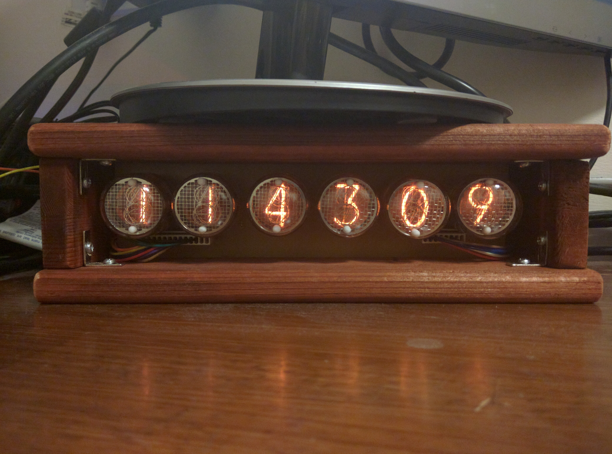
Board wiring
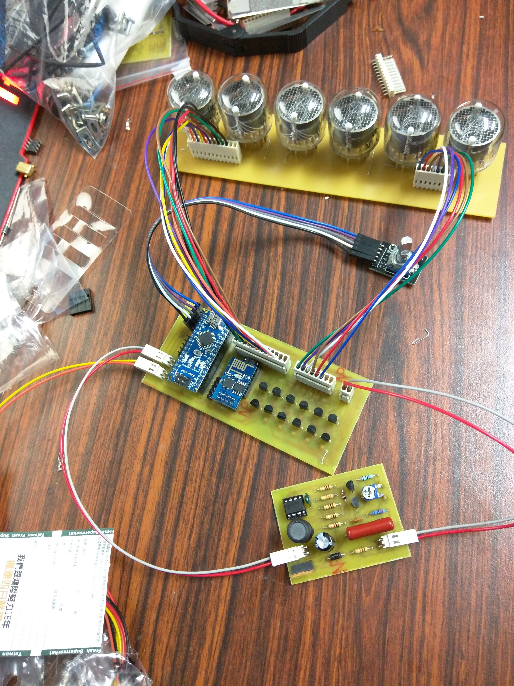
Case prototype with PCB installed
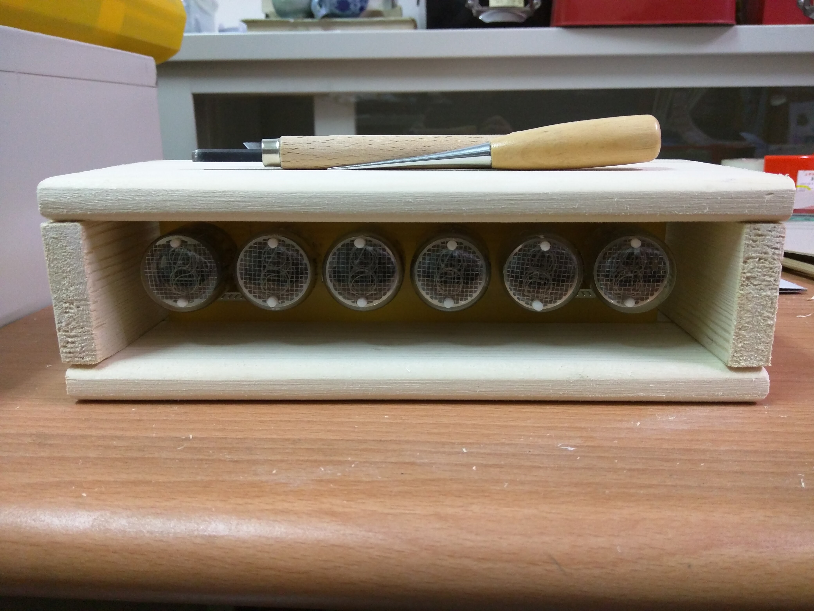
Back side of PCB
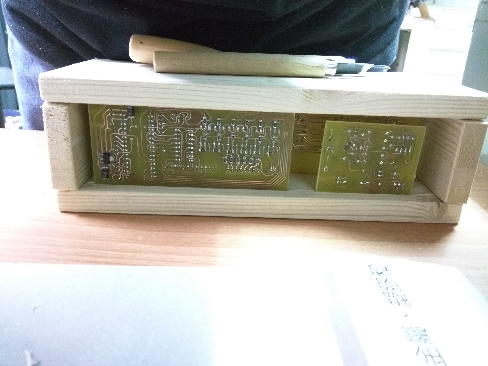
Testing (@9V 121mA)
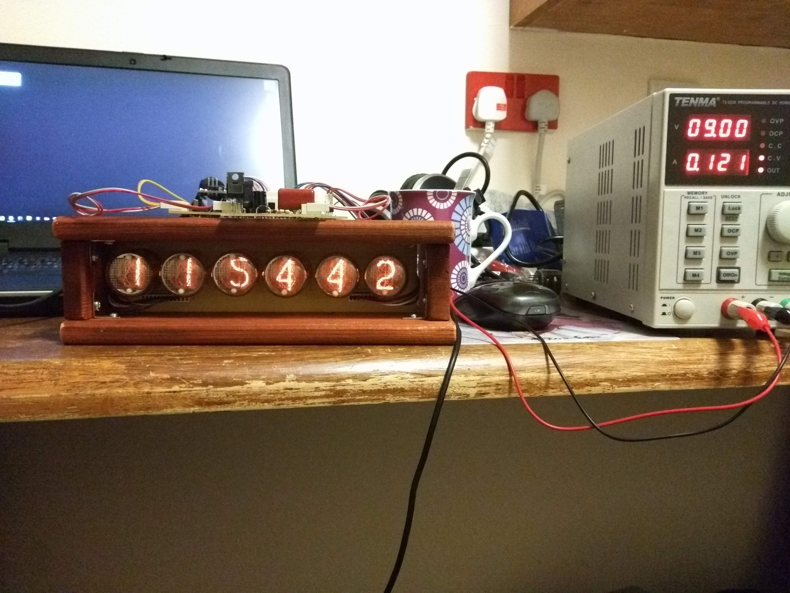
PCB exposed on the back
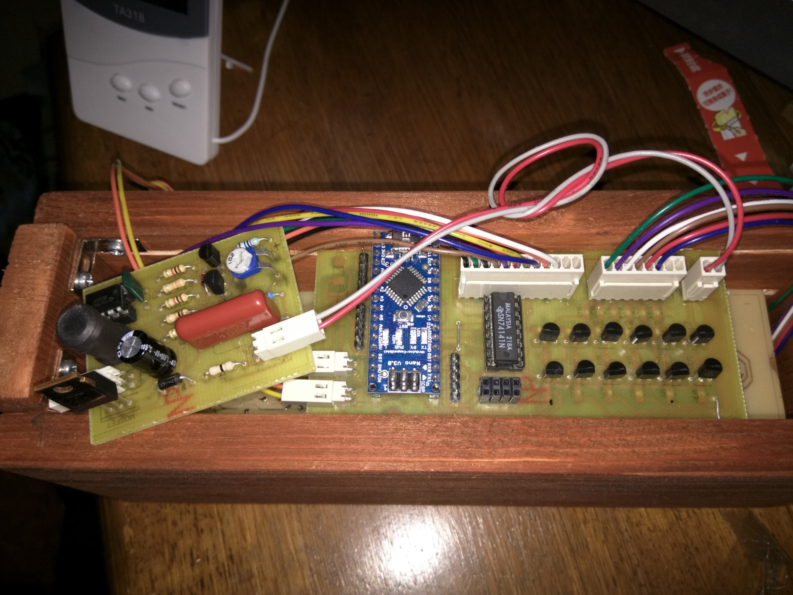
HVDC prototype
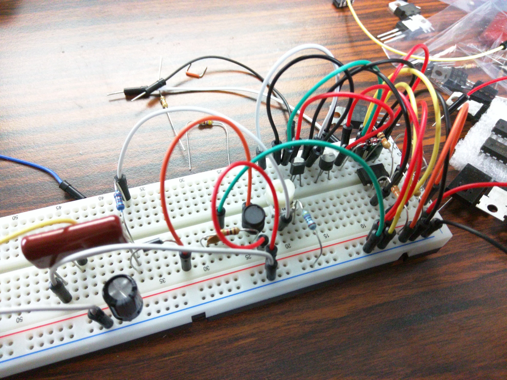
PCB
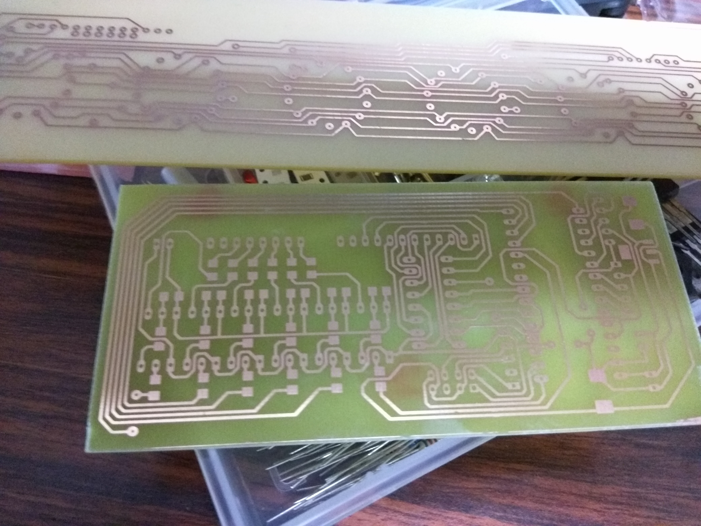
Nixie display board socket assembly
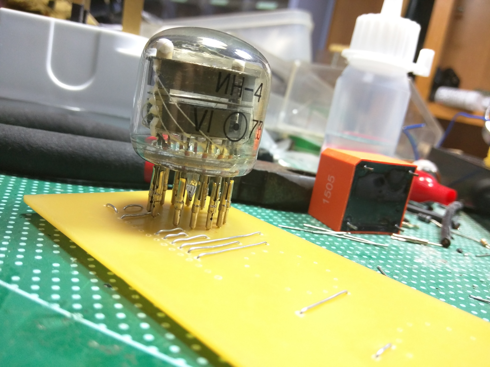
Display board assembly
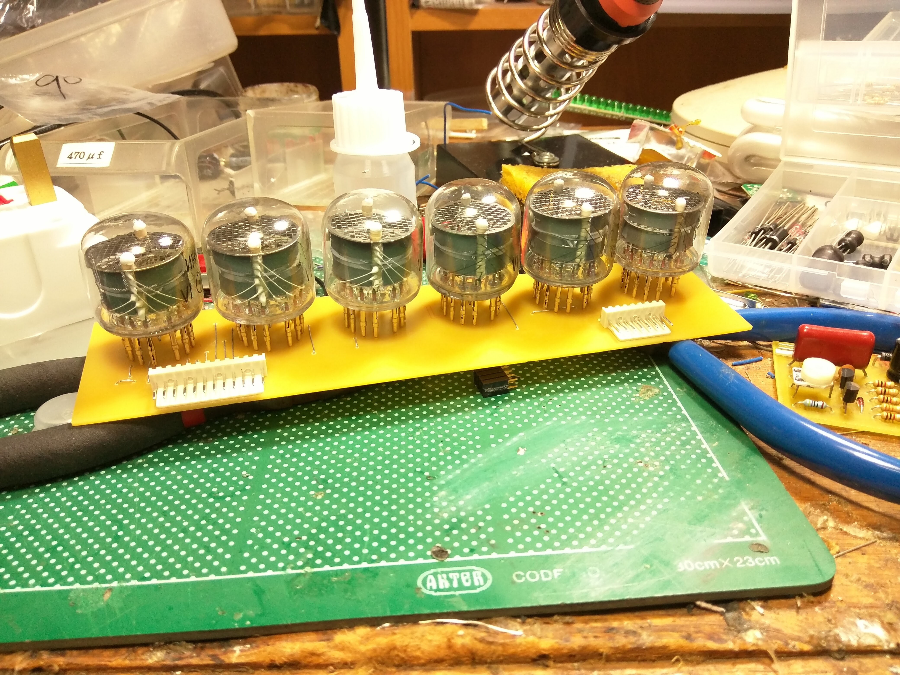
Display board close up
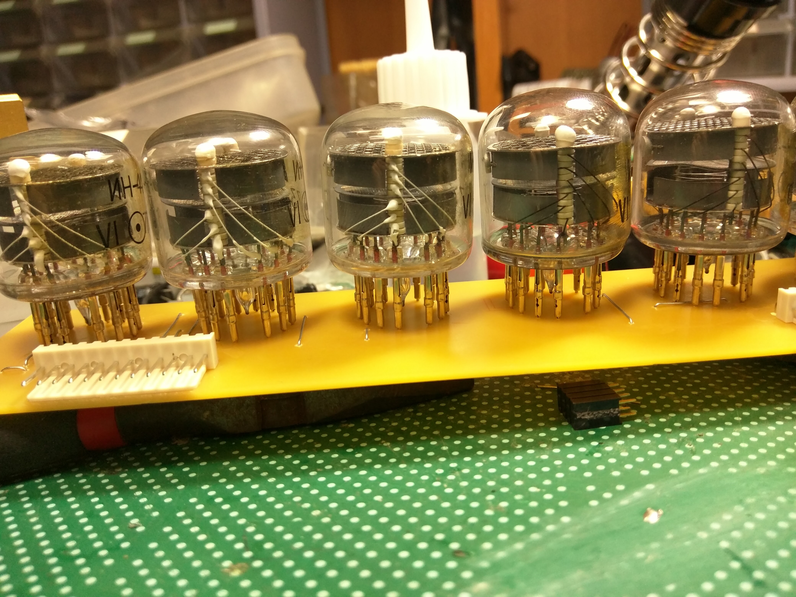
All PCB
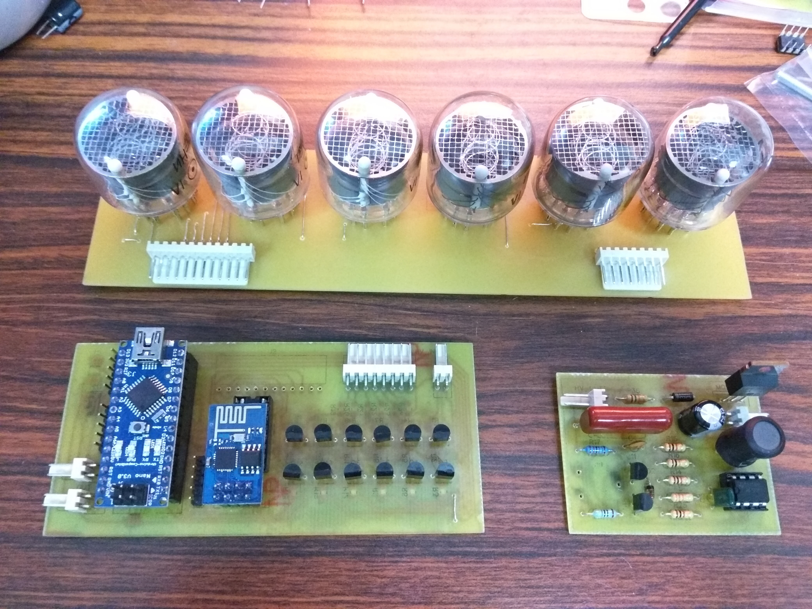
All PCB close up
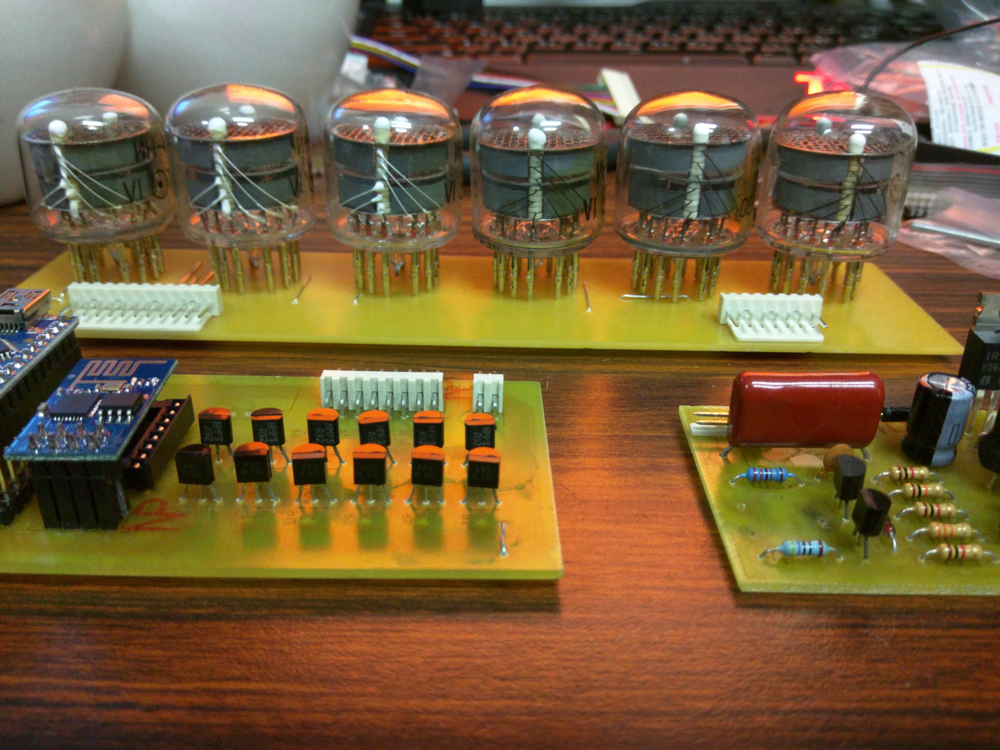
HVDC testing(300VDC)
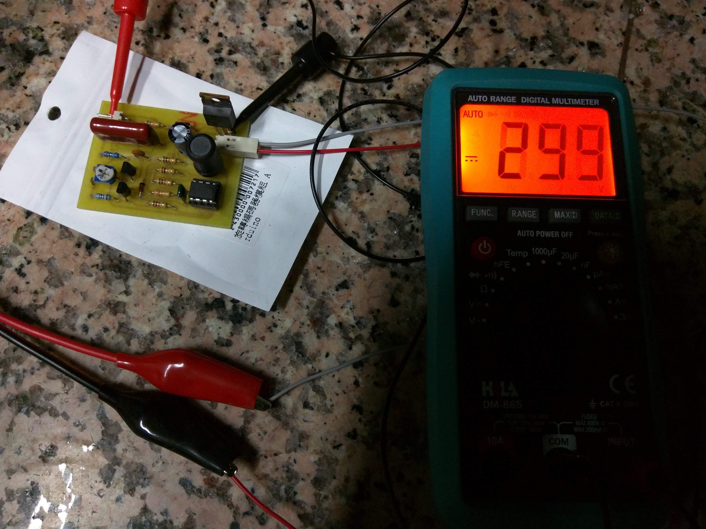

